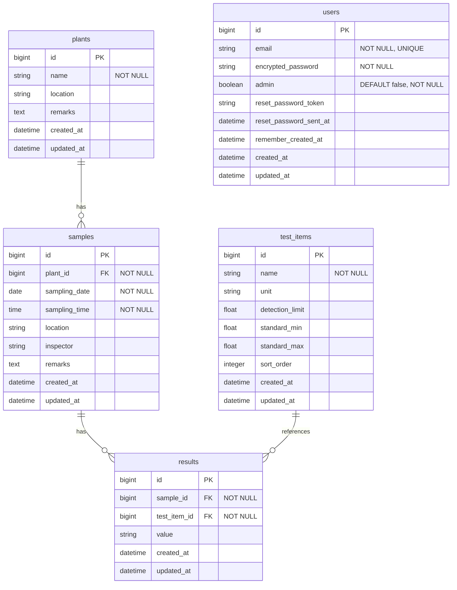

# 水質検査データ管理システム
 

## はじめに

このアプリは私が職場で使用することを想定して作成しました。
職場では、事業場から出る排水の水質検査を行っており、その検査結果をデータベースとしてMicrosoft Accessを使用して保存しています。
会社の方針で、今後Microsoft Accessが使用不可となることが決まっており、その後継として当アプリの開発に着手しました。  
 
## このアプリについて

- 事業場から出る排水の水質検査データを管理します。
- 事業場ごとに採水日とその検査データを保存できます。
- 検査項目は検査項目マスタで追加できます。
- 係の職員のみの使用を想定しているため、権限が付与されたユーザーのみがログインできます。  
 

## 主な使用技術

    
## データベース設計

## アプリ機能

| 機能 | 詳細 |
| --- | --- |
| 事業場管理 | 事業場一覧表示、個別事業場の詳細表示。一覧では文字列で絞り込みが可能。作成・編集・削除が可能 |
| 　- 検体 | 事業場ごとに検体を複数登録できる。編集・削除も可能 |
| 　　- 検査結果 | 検体ごとに複数の検査項目の結果を登録できる。編集・削除も可能。 基準を超過したものは赤色表示。 詳細ページではその事業場の同一検査項目について直近20検体分の結果・平均・最大・最小値とグラフを表示。 |
| 検査項目マスタ | 検査項目を追加・編集・削除できる。検査結果ページでの表示順を指定できる。 |
| データ入力 | 検体データを事業場で分けずに新しい順に一覧表示。最新の検査結果の入力に便利。 ここから検体の新規登録も可能 |
| ユーザー管理 | 本来はユーザーのログイン権限を管理します。 現在は公開用にユーザー管理ページへのアクセス権限としています。 アクセス権があるユーザーは他のユーザーにアクセス権を付与（剥奪）することができます。 |

## 検体詳細ページ

- Turbo frame、Turbo streamを使って新規登録、編集、削除を非同期化
- Stimulusを使ってformをモーダル化
- Stimulusを使ってセレクトボックスで検査項目を選ぶとリアルタイムで単位を表示
- 測定値の有効数字が検査項目によって異なるため、valueをあえてstring型にした。
- valueを数字で処理する必要があるときはto_fでfloat型に変換して使用した。
- 基準値を超過した結果の文字色を赤で表示

## 検査結果ページ

- Chart.jsを使って、過去20件分についてのグラフを表示

## 検査項目マスタ

- Turbo frame、Turbo streamを使って新規登録、編集、削除を非同期化
- Stimulusを使ってformをモーダル化

## ユーザー認証

- Deviseを使用したユーザー認証
- adminカラムを追加し、権限を付与されたものしかログインできないようにした。
